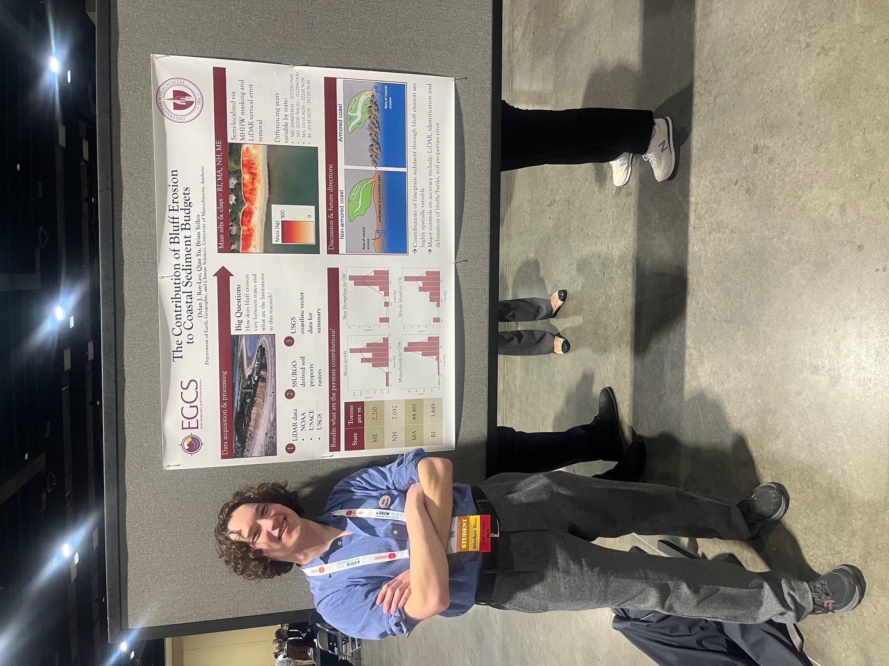

Authors
======
## Dylan Roy-Leo
## Qian Yu
## Brian Yellen

Abstract
======
Salt marsh ecosystems provide many valuable natural services to coastal communities. However, salt marshes require yearly sediment inputs, and some coastal regions lack the input often supplied by rivers. This begs the question of whether or not coastal erosion is a natural source of enough fine grain sediment to maintain salt marsh ecosystems. To answer this question, I combined LiDAR differencing techniques with a surficial geology database to quantify the mass of fine grain sediment introduced into the littoral zone through bluff erosion within coastal Massachusetts. Our results conclude that bluff erosion is a major supplier of sediment to the water column, and that when compared to the yearly amount of sediment required by marshes in Massachusetts to maintain elevations above sea level rise, bluff erosion could often theoretically supply this sediment alone in many areas. This suggests that bluff erosion needs to be considered a major component within coastal sediment budget calculations.

Pictures
======
!